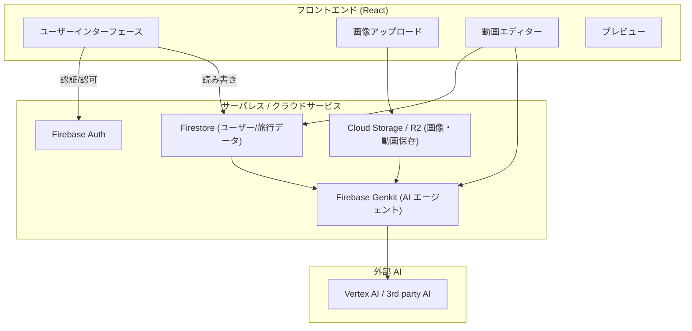

# 設計ドキュメント

## 概要

旅行振り返り動画生成機能は、ユーザーがアップロードした旅行写真から AI が自動的に縦画面の動画やスライドショーを生成し、編集・共有できるシステムです。フロントエンドは React、AI エージェントには Firebase Genkit を利用し、ユーザー情報・旅行情報はバックエンド API を新規作成する代わりに Firebase Firestore で一元管理します。

## アーキテクチャ

### システム全体構成（Firestore 中心）



### レイヤー構成（変更点）

1. **プレゼンテーション層**: React フロントエンド（クライアントから直接 Firestore / Storage / Genkit を利用する想定）
2. **認証層**: Firebase Auth（トークンを用いたアクセス制御）
3. **データ層**: Firestore（ユーザー・旅行・画像・動画メタデータをドキュメントで管理）
4. **AI/処理層**: Firebase Genkit と外部 AI（動画生成や画像解析の実行）
5. **ストレージ層**: Cloud Storage または Cloudflare R2（大容量バイナリ保存）

注: 軽微なサーバサイド処理（Webhook/Cloud Functions）が必要なケースは Cloud Functions で実装し、Firestore を真のソースオブトゥルースとして扱います。

## コンポーネントとインターフェース

### フロントエンドコンポーネント

#### 1. 画像アップロードコンポーネント

```typescript
interface ImageUploadProps {
  onImagesUploaded: (images: UploadedImage[]) => void;
  maxFiles: number;
  maxFileSize: number;
}

interface UploadedImage {
  id: string;
  file: File;
  preview: string;
  uploadStatus: "pending" | "uploading" | "completed" | "error";
}
```

#### 2. 旅行情報入力コンポーネント

```typescript
interface TravelInfoProps {
  onInfoChange: (info: TravelInfo) => void;
  initialInfo?: TravelInfo;
}

interface TravelInfo {
  title: string;
  startDate: Date;
  endDate: Date;
  description?: string;
}
```

#### 3. 動画エディターコンポーネント

```typescript
interface VideoEditorProps {
  generatedVideo: GeneratedVideo;
  onVideoUpdate: (video: EditedVideo) => void;
}

interface GeneratedVideo {
  id: string;
  url: string;
  duration: number;
  scenes: Scene[];
  metadata: VideoMetadata;
}
```

#### 4. AI チャットコンポーネント

```typescript
interface AIChatProps {
  videoId: string;
  onVideoUpdate: (updates: VideoUpdate[]) => void;
}

interface ChatMessage {
  id: string;
  type: "user" | "ai";
  content: string;
  timestamp: Date;
  suggestions?: VideoUpdate[];
}
```

### Firestore を使ったデータアクセス設計（API の代替）

本設計では、ユーザー管理・旅行情報管理・メタデータ保存は直接 Firestore を使って行い、REST API サーバの新規作成は最小化します。以下は Firestore ドキュメント構造の例です。

- users/{userId}
  - email: string
  - name: string
  - createdAt: timestamp
  - profile: {...}

- travels/{travelId}
  - userId: string
  - title: string
  - description: string
  - startDate: timestamp
  - endDate: timestamp
  - status: string
  - createdAt: timestamp

- travels/{travelId}/images/{imageId}
  - originalName: string
  - storagePath: string
  - url: string
  - size: number
  - mimeType: string
  - width: number
  - height: number
  - metadata: map
  - analysisData: map
  - createdAt: timestamp

- travels/{travelId}/videos/{videoId}
  - title, storagePath, url, thumbnailUrl, duration, width, height, size, status, style, scenes, music, effects, isPublic, createdAt, updatedAt

フロントエンドは Firebase SDK（Firestore/Storage/Auth）を直接利用して上記ドキュメントを読み書きします。生成処理の開始や完了通知、長時間処理の管理は Cloud Functions と Firestore トリガーで実装します（例: videos ドキュメントの status を更新するワークフロー）。

必要に応じて軽量な REST エンドポイント（例：外部サービス向けの webhook ハンドラや非公開管理用 API）は Cloud Functions（HTTP）で実装しますが、通常の CRUD は Firestore で完結します。

### AI エージェントインターフェース

#### 1. 画像解析サービス

```typescript
interface ImageAnalysisService {
  analyzeImages(images: ImageData[]): Promise<ImageAnalysisResult[]>;
  detectLocations(images: ImageData[]): Promise<LocationInfo[]>;
  extractMetadata(images: ImageData[]): Promise<ImageMetadata[]>;
}

interface ImageAnalysisResult {
  imageId: string;
  objects: DetectedObject[];
  scenes: SceneType[];
  emotions: EmotionScore[];
  quality: QualityMetrics;
}
```

#### 2. 動画生成サービス

```typescript
interface VideoGenerationService {
  generateVideo(request: VideoGenerationRequest): Promise<GeneratedVideo>;
  applyEffects(videoId: string, effects: Effect[]): Promise<GeneratedVideo>;
  addMusic(videoId: string, musicStyle: MusicStyle): Promise<GeneratedVideo>;
}

interface VideoGenerationRequest {
  images: ImageData[];
  travelInfo: TravelInfo;
  locationInfo: LocationInfo[];
  style: VideoStyle;
  duration: number;
}
```

#### 3. チャットエージェントサービス

```typescript
interface ChatAgentService {
  processMessage(message: string, context: ChatContext): Promise<ChatResponse>;
  generateSuggestions(videoData: VideoData): Promise<VideoUpdate[]>;
  interpretRequest(message: string): Promise<ActionIntent>;
}

interface ActionIntent {
  type: "edit" | "regenerate" | "style_change" | "music_change";
  parameters: Record<string, any>;
  confidence: number;
}
```

## データモデル（Firestore ドキュメント例）

この設計では Firestore を一次データストアとして使うため、Go の構造体ではなくドキュメントスキーマ例を記述します。

- users/{userId}
  - email: string
  - name: string
  - createdAt: timestamp
  - updatedAt: timestamp

- travels/{travelId}
  - userId: string
  - title: string
  - description: string
  - startDate: timestamp
  - endDate: timestamp
  - status: string // "draft" | "processing" | "completed"
  - createdAt: timestamp
  - updatedAt: timestamp

- travels/{travelId}/images/{imageId}
  - originalName: string
  - storagePath: string
  - url: string
  - size: number
  - mimeType: string
  - width: number
  - height: number
  - metadata: map
  - analysisData: map
  - createdAt: timestamp

- travels/{travelId}/videos/{videoId}
  - title: string
  - storagePath: string
  - url: string
  - thumbnailUrl: string
  - duration: number
  - width: number
  - height: number
  - size: number
  - status: string // "generating" | "completed" | "error"
  - style: map
  - scenes: array
  - music: map
  - effects: map
  - shareUrl: string
  - isPublic: boolean
  - createdAt: timestamp
  - updatedAt: timestamp

チャットの履歴は travels/{travelId}/videos/{videoId}/chatHistory/{chatId} などのサブコレクションで管理します。Firestore のセキュリティルールを用いてユーザー毎のアクセス制御を厳格に設定してください。

## エラーハンドリング（Firestore / Genkit 前提）

- フロントエンドは Firestore SDK のエラーコード（permission-denied, not-found, unavailable など）をハンドリングします。クライアント側で retryable 判定を行い、ユーザーに明確なメッセージを返します。
- 長時間処理（動画生成等）は videos ドキュメントの status と progress を使って進捗管理。Cloud Functions のリトライロジックや Genkit のエラーを捕捉して videos ドキュメントにエラー情報を保存します。
- AI サービス呼び出しの失敗時は、Genkit / VertexAI のエラーを Cloud Functions 内でハンドリングし、必要に応じてフォールバック（軽量なスライドショー生成など）を提供します。

エラー種別例:
- validation / client-side (ファイルサイズ超過, 形式エラー)
- auth / permission (Firebase Auth / Firestore ルール違反)
- transient (ネットワーク, VertexAI の一時障害)
- processing (動画生成の内部失敗)

各エラーは Firestore のログコレクションに記録し、運用時は Cloud Monitoring / Error Reporting と連携してください。

## テスト戦略（Firestore / Cloud Functions 前提）

### フロントエンド
- 単体テスト: React コンポーネント（vitest）
- Firestore の読み書きは Firebase のエミュレータを使ったインテグレーションテストを推奨

### サーバレス（Cloud Functions / Genkit）
- 単体テスト: 小さな関数ごとにユニットテスト
- エンドツーエンド: Genkit 呼び出しと Storage/Firestore のやり取りはモック化・エミュレータで確認

### AI サービス
- モックテスト: Genkit / VertexAI のモックレスポンスを用意
- 品質テスト: 生成動画のサンプル評価を自動化（簡易メトリクス: 解像度, 期間, シーン数）

### テストデータ管理
- Firebase emulator の seed スクリプトを用意し、CI で reproducible な環境を準備します。

## セキュリティ考慮事項（Firestore/Firestore Rules 前提）

### 認証・認可
- Firebase Auth を認証基盤として利用。Firestore セキュリティルールでユーザー単位のアクセス制御を明確に定義します（例: travels ドキュメントは owner のみ書込可）。

### ファイルセキュリティ
- Storage のアップロードルールとクライアント側検証を組合わせる。必要なら Cloud Functions でウイルススキャンやコンテンツ検査を実行します。

### データ保護
- Firestore は暗号化済み。個人情報の削除はドキュメント削除 + Storage のオブジェクト削除をトランザクション化して確実に行うワークフローを用意します。

### AI セキュリティ
- Genkit / VertexAI へ送る入力はサニタイズし、誤用を防ぐために利用制限を設けます。API キーは Secret Manager か環境変数で管理し、クライアント側に直接公開しないでください。

---

変更点まとめ:
- ユーザー/旅行情報は Firestore で一元管理。
- CRUD は原則 Firestore SDK でクライアントが直接実行。
- 長時間処理や外部連携は Cloud Functions が仲介し、Firestore を真のソースオブトゥルースとする。
