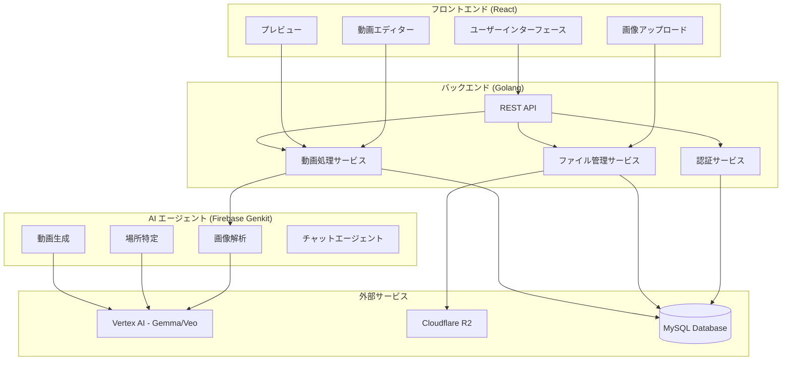

# 設計ドキュメント

## 概要

旅行振り返り動画生成機能は、ユーザーがアップロードした旅行写真から AI が自動的に縦画面の動画やスライドショーを生成し、編集・共有できるシステムです。React フロントエンド、Golang バックエンド、Firebase Genkit を使用した AI エージェントで構成されます。

## アーキテクチャ

### システム全体構成



### レイヤー構成

1. **プレゼンテーション層**: React フロントエンド
2. **アプリケーション層**: Golang REST API
3. **ドメイン層**: ビジネスロジック
4. **インフラストラクチャ層**: データベース、ストレージ、AI サービス

## コンポーネントとインターフェース

### フロントエンドコンポーネント

#### 1. 画像アップロードコンポーネント

```typescript
interface ImageUploadProps {
  onImagesUploaded: (images: UploadedImage[]) => void;
  maxFiles: number;
  maxFileSize: number;
}

interface UploadedImage {
  id: string;
  file: File;
  preview: string;
  uploadStatus: "pending" | "uploading" | "completed" | "error";
}
```

#### 2. 旅行情報入力コンポーネント

```typescript
interface TravelInfoProps {
  onInfoChange: (info: TravelInfo) => void;
  initialInfo?: TravelInfo;
}

interface TravelInfo {
  title: string;
  startDate: Date;
  endDate: Date;
  description?: string;
}
```

#### 3. 動画エディターコンポーネント

```typescript
interface VideoEditorProps {
  generatedVideo: GeneratedVideo;
  onVideoUpdate: (video: EditedVideo) => void;
}

interface GeneratedVideo {
  id: string;
  url: string;
  duration: number;
  scenes: Scene[];
  metadata: VideoMetadata;
}
```

#### 4. AI チャットコンポーネント

```typescript
interface AIChatProps {
  videoId: string;
  onVideoUpdate: (updates: VideoUpdate[]) => void;
}

interface ChatMessage {
  id: string;
  type: "user" | "ai";
  content: string;
  timestamp: Date;
  suggestions?: VideoUpdate[];
}
```

### バックエンド API エンドポイント

#### 1. 画像管理 API

```go
// POST /api/v1/images/upload
type UploadImageRequest struct {
    Images []multipart.FileHeader `form:"images"`
    TravelID string `form:"travel_id"`
}

type UploadImageResponse struct {
    Images []ImageInfo `json:"images"`
}

// GET /api/v1/images/{travel_id}
type GetImagesResponse struct {
    Images []ImageInfo `json:"images"`
}
```

#### 2. 動画生成 API

```go
// POST /api/v1/videos/generate
type GenerateVideoRequest struct {
    TravelID string `json:"travel_id"`
    TravelInfo TravelInfo `json:"travel_info"`
    ImageIDs []string `json:"image_ids"`
    Style VideoStyle `json:"style"`
}

type GenerateVideoResponse struct {
    VideoID string `json:"video_id"`
    Status string `json:"status"`
    EstimatedTime int `json:"estimated_time_seconds"`
}

// GET /api/v1/videos/{video_id}/status
type VideoStatusResponse struct {
    Status string `json:"status"`
    Progress int `json:"progress"`
    VideoURL string `json:"video_url,omitempty"`
}
```

#### 3. 動画編集 API

```go
// PUT /api/v1/videos/{video_id}/edit
type EditVideoRequest struct {
    Updates []VideoUpdate `json:"updates"`
}

type VideoUpdate struct {
    Type string `json:"type"` // "text", "music", "order", "effect"
    Target string `json:"target"`
    Value interface{} `json:"value"`
}
```

#### 4. AI チャット API

```go
// POST /api/v1/chat/{video_id}
type ChatRequest struct {
    Message string `json:"message"`
    Context ChatContext `json:"context"`
}

type ChatResponse struct {
    Response string `json:"response"`
    Suggestions []VideoUpdate `json:"suggestions"`
    RequiresConfirmation bool `json:"requires_confirmation"`
}
```

### AI エージェントインターフェース

#### 1. 画像解析サービス

```typescript
interface ImageAnalysisService {
  analyzeImages(images: ImageData[]): Promise<ImageAnalysisResult[]>;
  detectLocations(images: ImageData[]): Promise<LocationInfo[]>;
  extractMetadata(images: ImageData[]): Promise<ImageMetadata[]>;
}

interface ImageAnalysisResult {
  imageId: string;
  objects: DetectedObject[];
  scenes: SceneType[];
  emotions: EmotionScore[];
  quality: QualityMetrics;
}
```

#### 2. 動画生成サービス

```typescript
interface VideoGenerationService {
  generateVideo(request: VideoGenerationRequest): Promise<GeneratedVideo>;
  applyEffects(videoId: string, effects: Effect[]): Promise<GeneratedVideo>;
  addMusic(videoId: string, musicStyle: MusicStyle): Promise<GeneratedVideo>;
}

interface VideoGenerationRequest {
  images: ImageData[];
  travelInfo: TravelInfo;
  locationInfo: LocationInfo[];
  style: VideoStyle;
  duration: number;
}
```

#### 3. チャットエージェントサービス

```typescript
interface ChatAgentService {
  processMessage(message: string, context: ChatContext): Promise<ChatResponse>;
  generateSuggestions(videoData: VideoData): Promise<VideoUpdate[]>;
  interpretRequest(message: string): Promise<ActionIntent>;
}

interface ActionIntent {
  type: "edit" | "regenerate" | "style_change" | "music_change";
  parameters: Record<string, any>;
  confidence: number;
}
```

## データモデル

### 1. ユーザーモデル

```go
type User struct {
    ID        string    `json:"id" gorm:"primaryKey"`
    Email     string    `json:"email" gorm:"unique;not null"`
    Name      string    `json:"name"`
    CreatedAt time.Time `json:"created_at"`
    UpdatedAt time.Time `json:"updated_at"`
}
```

### 2. 旅行モデル

```go
type Travel struct {
    ID          string    `json:"id" gorm:"primaryKey"`
    UserID      string    `json:"user_id" gorm:"not null"`
    Title       string    `json:"title" gorm:"not null"`
    Description string    `json:"description"`
    StartDate   time.Time `json:"start_date"`
    EndDate     time.Time `json:"end_date"`
    Status      string    `json:"status"` // "draft", "processing", "completed"
    CreatedAt   time.Time `json:"created_at"`
    UpdatedAt   time.Time `json:"updated_at"`

    User   User    `json:"user" gorm:"foreignKey:UserID"`
    Images []Image `json:"images" gorm:"foreignKey:TravelID"`
    Videos []Video `json:"videos" gorm:"foreignKey:TravelID"`
}
```

### 3. 画像モデル

```go
type Image struct {
    ID           string    `json:"id" gorm:"primaryKey"`
    TravelID     string    `json:"travel_id" gorm:"not null"`
    OriginalName string    `json:"original_name"`
    StoragePath  string    `json:"storage_path"`
    URL          string    `json:"url"`
    Size         int64     `json:"size"`
    MimeType     string    `json:"mime_type"`
    Width        int       `json:"width"`
    Height       int       `json:"height"`
    Metadata     JSON      `json:"metadata"` // EXIF, location, etc.
    AnalysisData JSON      `json:"analysis_data"` // AI analysis results
    CreatedAt    time.Time `json:"created_at"`

    Travel Travel `json:"travel" gorm:"foreignKey:TravelID"`
}
```

### 4. 動画モデル

```go
type Video struct {
    ID           string    `json:"id" gorm:"primaryKey"`
    TravelID     string    `json:"travel_id" gorm:"not null"`
    Title        string    `json:"title"`
    StoragePath  string    `json:"storage_path"`
    URL          string    `json:"url"`
    ThumbnailURL string    `json:"thumbnail_url"`
    Duration     int       `json:"duration"` // seconds
    Width        int       `json:"width"`
    Height       int       `json:"height"`
    Size         int64     `json:"size"`
    Status       string    `json:"status"` // "generating", "completed", "error"
    Style        JSON      `json:"style"`
    Scenes       JSON      `json:"scenes"`
    Music        JSON      `json:"music"`
    Effects      JSON      `json:"effects"`
    ShareURL     string    `json:"share_url"`
    IsPublic     bool      `json:"is_public"`
    CreatedAt    time.Time `json:"created_at"`
    UpdatedAt    time.Time `json:"updated_at"`

    Travel Travel `json:"travel" gorm:"foreignKey:TravelID"`
}
```

### 5. チャット履歴モデル

```go
type ChatHistory struct {
    ID        string    `json:"id" gorm:"primaryKey"`
    VideoID   string    `json:"video_id" gorm:"not null"`
    UserID    string    `json:"user_id" gorm:"not null"`
    Message   string    `json:"message"`
    Response  string    `json:"response"`
    Intent    JSON      `json:"intent"`
    Actions   JSON      `json:"actions"`
    CreatedAt time.Time `json:"created_at"`

    Video Video `json:"video" gorm:"foreignKey:VideoID"`
    User  User  `json:"user" gorm:"foreignKey:UserID"`
}
```

## エラーハンドリング

### 1. フロントエンドエラーハンドリング

```typescript
interface ErrorState {
  type: "upload" | "generation" | "editing" | "network";
  message: string;
  code?: string;
  retryable: boolean;
}

class ErrorHandler {
  static handleUploadError(error: UploadError): ErrorState;
  static handleGenerationError(error: GenerationError): ErrorState;
  static handleNetworkError(error: NetworkError): ErrorState;
}
```

### 2. バックエンドエラーハンドリング

```go
type APIError struct {
    Code    string `json:"code"`
    Message string `json:"message"`
    Details string `json:"details,omitempty"`
}

type ErrorCode string

const (
    ErrInvalidInput     ErrorCode = "INVALID_INPUT"
    ErrFileTooBig      ErrorCode = "FILE_TOO_BIG"
    ErrUnsupportedType ErrorCode = "UNSUPPORTED_TYPE"
    ErrGenerationFailed ErrorCode = "GENERATION_FAILED"
    ErrNotFound        ErrorCode = "NOT_FOUND"
    ErrUnauthorized    ErrorCode = "UNAUTHORIZED"
    ErrInternalError   ErrorCode = "INTERNAL_ERROR"
)
```

### 3. AI サービスエラーハンドリング

```typescript
interface AIServiceError {
  service: "image_analysis" | "video_generation" | "chat_agent";
  error: string;
  retryable: boolean;
  fallbackAvailable: boolean;
}

class AIErrorHandler {
  static handleVertexAIError(error: VertexAIError): AIServiceError;
  static handleGenkitError(error: GenkitError): AIServiceError;
}
```

## テスト戦略

### 1. フロントエンドテスト

- **単体テスト**: React コンポーネントのテスト（vitest）

### 2. バックエンドテスト

- **単体テスト**: 各サービス・ハンドラーのテスト

### 3. AI サービステスト

- **モックテスト**: AI サービスのモック化テスト
- **品質テスト**: 生成される動画の品質評価
- **レスポンス時間テスト**: AI 処理時間の測定

### 4. テストデータ管理

```go
type TestDataManager struct {
    SampleImages []TestImage
    SampleTravels []TestTravel
    MockAIResponses map[string]interface{}
}

func (t *TestDataManager) SetupTestData() error
func (t *TestDataManager) CleanupTestData() error
```

### 5. テスト環境

- **開発環境**: ローカル開発用（Docker Compose）
- **ステージング環境**: 本番環境と同等の構成
- **CI/CD パイプライン**: 自動テスト実行

## セキュリティ考慮事項

### 1. 認証・認可

- JWT トークンベースの認証
- ユーザーごとのリソースアクセス制御
- API レート制限

### 2. ファイルセキュリティ

- アップロードファイルの検証（ファイル形式、サイズ、内容）
- ウイルススキャン
- 安全なファイル名生成

### 3. データ保護

- 個人情報の暗号化
- GDPR 準拠のデータ削除機能
- アクセスログの記録

### 4. AI セキュリティ

- 入力データの検証
- 生成コンテンツの適切性チェック
- AI サービスの API キー管理
